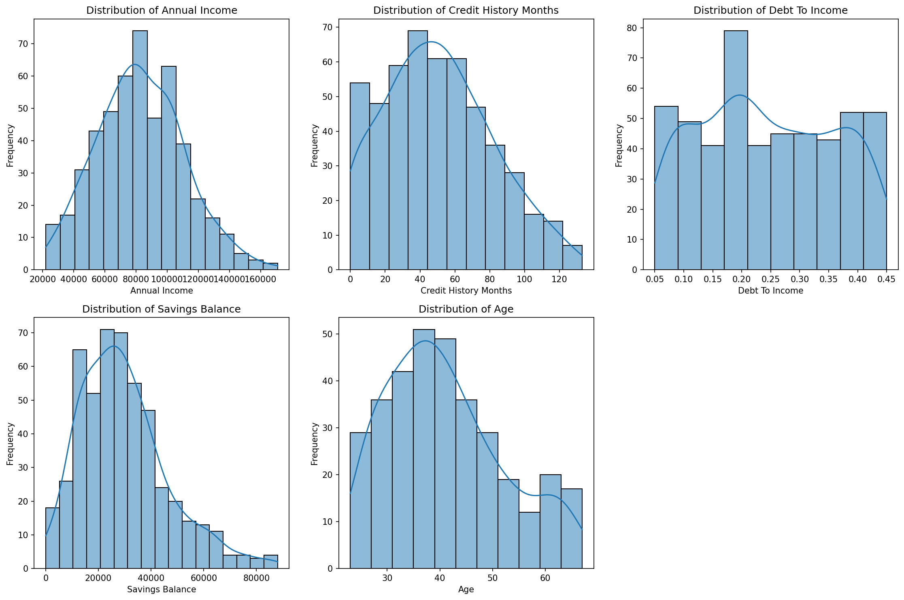
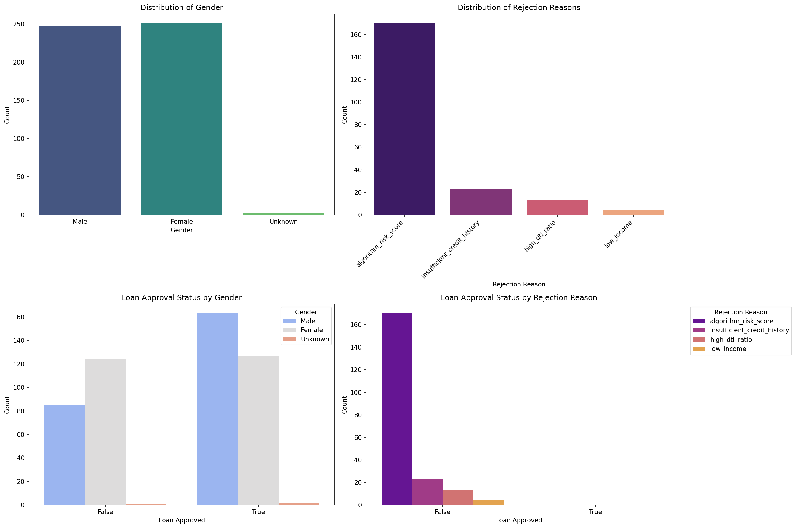
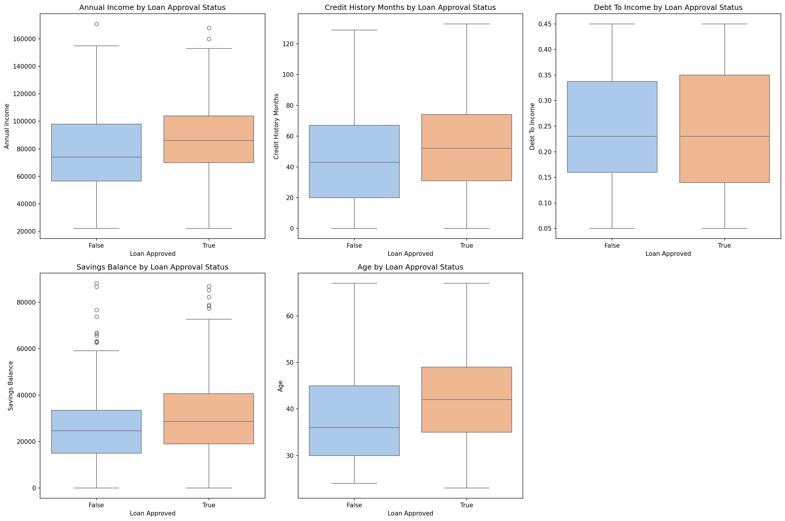
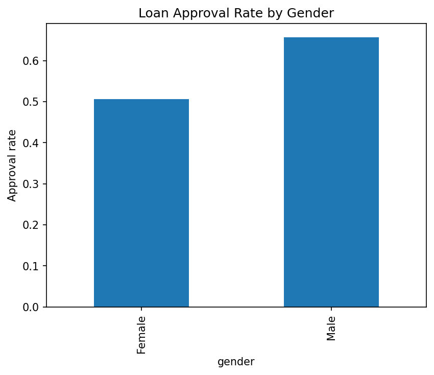
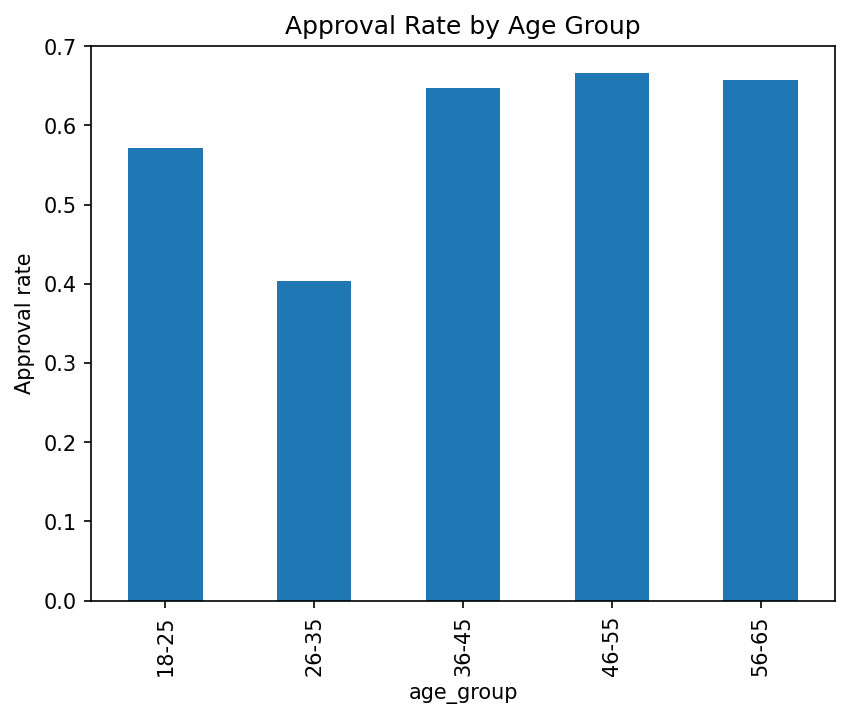
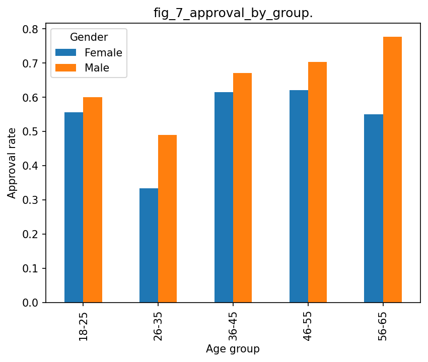
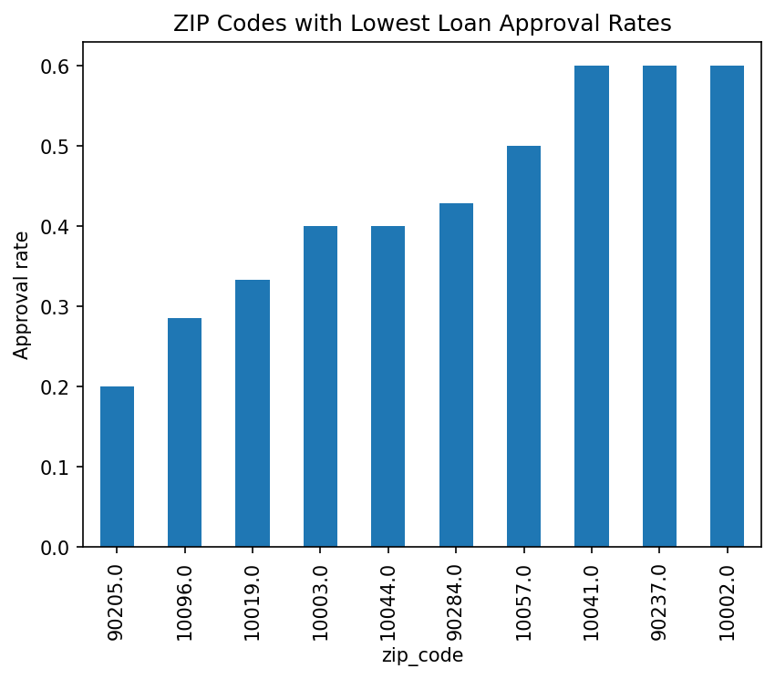
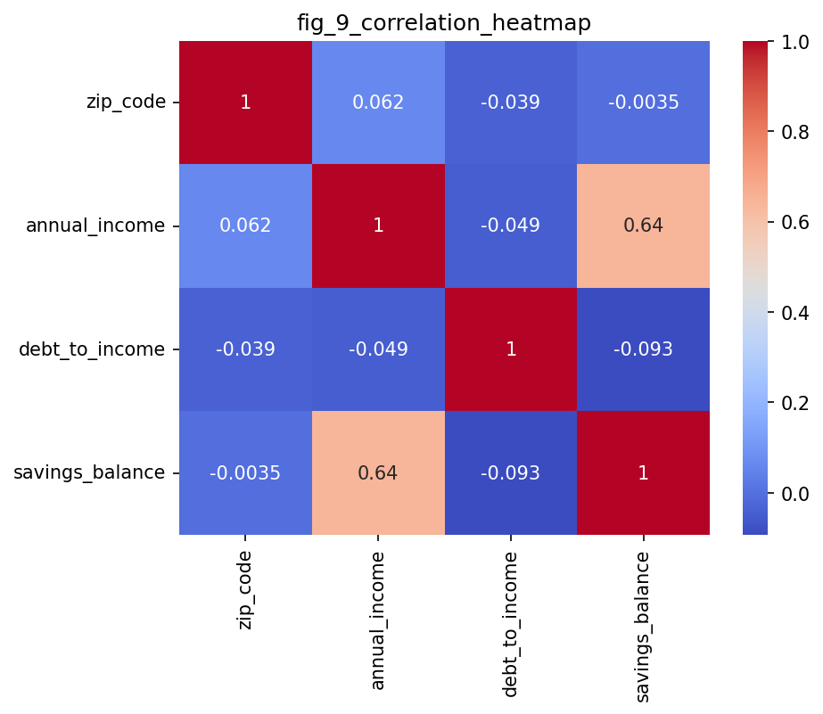

# dego-project-team11-TXC
**DEGO 2606 Group Project – Credit Application Governance Analysis**  
MSc Business Analytics | Nova SBE

---

## Team Members & Roles

| Name | Role |
|------|------|
| Inês Monteiro | Data Engineer: data ingestion, cleaning pipeline, repository structure |
| Anh Nguyen | Data Scientist: bias analysis, fairness metrics, statistical testing |
| Estêvão Fernandes | Governance Officer: GDPR mapping, compliance analysis, policy recommendations |
| Jonas Knosp | Product Lead: coordination, README, presentation narrative |

---

## Executive Summary

This report presents the findings of a data governance audit conducted on `raw_credit_applications.json`, a dataset of **502 credit applications** from NovaCred, a fintech company under regulatory scrutiny for potential discriminatory lending practices. The audit was structured around three analytical pillars: **data quality assessment**, **algorithmic bias detection**, and **privacy and GDPR compliance evaluation**.

Key findings are summarised below:

- **162 records (32.3%)** have `date_of_birth` in a non-standard or missing format — 101 records use `MM/DD/YYYY`, 56 use `YYYY/MM/DD`, and 5 are empty strings — preventing reliable age computation without prior normalisation.
- **22.1% of records (111/502)** exhibit inconsistent gender encoding, with **six distinct representations** (`Male`, `M`, `Female`, `F`, empty string, and absent field) used for what should be a controlled categorical field — a critical validity and consistency failure prior to any modelling step.
- A statistically significant gender-based disparity in loan approval rates was identified. Applying the four-fifths rule, the computed **Disparate Impact Ratio of 0.770** falls below the 0.80 threshold, indicating potential unlawful disparate impact on female applicants under EU anti-discrimination frameworks.
- **Intersectional bias** is more severe than either dimension alone: women aged 26–35 have an approval rate of approximately **33%**, compared to **78%** for men aged 56–65 — a 45-percentage-point gap that is invisible when examining gender or age in isolation.
- **`zip_code` acts as a proxy for gender** (point-biserial correlation: −0.806), meaning geographic filtering reproduces gender bias even if gender is removed from the model.
- **Multiple categories of PII** — including Social Security Numbers, full names, email addresses, IP addresses, and dates of birth — are stored in plaintext with no evidence of pseudonymisation, encryption, or access controls, in direct conflict with GDPR Articles 5 and 25.
- **No consent tracking mechanism exists** in any of the 502 records (`consent_timestamp`, `processing_purpose`, and `data_source` are absent across the entire dataset), making it impossible for NovaCred to demonstrate a lawful basis for processing under GDPR Art. 6.
- The dominant rejection mechanism (`algorithm_risk_score`, accounting for **81.7% of denials**) is non-transparent and non-auditable, raising high-risk AI system concerns under the EU AI Act (Annex III, §5(b)).

---

## Repository Structure

```
dego-project-team11-TXC/
├── README.md
├── data/
│   ├── raw_credit_applications.json
│   └── cleaned_credit_applications.csv
├── figures/
│   ├── fig_1_histograms_for_num_cols.png
│   ├── fig_2_categorical_feature_distributions.png
│   ├── fig_3_numerical_features_vs_loan_approval_boxplots.png
│   ├── fig_4_Loan_Approval_Rate_by_Gender.png
│   ├── fig_5_Rejection_Reasons.png
│   ├── fig_6_Approval_Rate_by_Age_Group.png
│   ├── fig_7_Approval_Rate_by_Age_and_Gender.png
│   ├── fig_8_ZIP_Codes_with_Lowest_Approval_Rates.png
│   └── fig_9_correlation_heatmap.png
├── notebooks/
│   ├── 01-data-quality.ipynb
│   ├── 02-bias-analysis.ipynb
│   └── 03-privacy-demo.ipynb
├── presentation/
│   ├── Dego Project_Team11_TXC_Video presentation.pdf
│   └── Video Presentation YouTube Link.rtf
├── src/
│   └── fairness_utils.py
└── .gitignore
```

---

## Dataset Overview

**Source file:** `data/raw_credit_applications.json`  
**Format:** Nested JSON (not a flat tabular structure)  
**N:** 502 credit applications  
**Overall approval rate:** 58.2% (292/502)

### Schema Summary

| Field Path | Type | Description |
|-----------|------|-------------|
| `_id` | String | Application ID |
| `applicant_info.full_name` | String | Applicant full name |
| `applicant_info.email` | String | Email address |
| `applicant_info.ssn` | String | Social Security Number |
| `applicant_info.ip_address` | String | IP address at application time |
| `applicant_info.gender` | String | Gender (inconsistently encoded — see §1.2) |
| `applicant_info.date_of_birth` | String | Date of birth (inconsistent formats — see §1.5) |
| `applicant_info.zip_code` | String | ZIP/postal code |
| `financials.annual_income` | Number | Annual income (5 records use `annual_salary` — see §1.2) |
| `financials.credit_history_months` | Integer | Months of credit history |
| `financials.debt_to_income` | Number | Debt-to-income ratio |
| `financials.savings_balance` | Number | Savings balance |
| `spending_behavior[].category` | String | Spending category label |
| `spending_behavior[].amount` | Number | Monthly spending amount |
| `decision.loan_approved` | Boolean | Approval outcome |
| `decision.interest_rate` | Number | Assigned rate (if approved) |
| `decision.approved_amount` | Number | Approved loan amount (if approved) |
| `decision.rejection_reason` | String | Rejection label (if denied) |
| `processing_timestamp` | String | Timestamp of processing (87.6% missing) |
| `loan_purpose` | String | Stated purpose of loan (~89.6% missing) |


---

## 1. Data Quality Analysis

Full methodology and remediation code: `notebooks/01-data-quality.ipynb`

All issues identified below are documented and quantified in `notebooks/01-data-quality.ipynb` and `notebooks/02-bias-analysis.ipynb`.

### 1.1 Completeness

| Field | Missing (n) | Missing (%) |
|-------|------------|------------|
| `loan_purpose` | ~450 | ~89.6% |
| `processing_timestamp` | 440 | 87.6% |
| `email` | 7 | 1.4% |
| `date_of_birth` | 5 | 1.0% |
| `ssn` | 5 | 1.0% |
| `annual_income` | 5 | 1.0% |
| `gender` | 3 | 0.6% |

`loan_purpose` (~89.6% missing) and `processing_timestamp` (87.6% missing) are effectively absent and cannot be used analytically. Notably, `loan_purpose` is the most sparsely populated field in the dataset. The near-total absence of `processing_timestamp` means NovaCred cannot demonstrate GDPR storage limitation compliance (Art. 5(1)(e)) or produce the audit trails required under the EU AI Act (Art. 12).

  
*Figure 1: Distributions of all numerical features.*

### 1.2 Consistency

| Issue | Affected Records (n) | Affected Records (%) |
|-------|---------------------|---------------------|
| Inconsistent gender encoding (6 distinct values: `Male`, `M`, `Female`, `F`, `""`, absent) | 111 | 22.1% |
| Inconsistent `date_of_birth` formats (see §1.5) | 157 | 31.3% |
| Field name mismatch: `annual_salary` instead of `annual_income` | 5 | 1.0% |
| `annual_income` stored as string instead of number | 8 | 1.6% |
| Duplicate `_id` values | 2 | 0.4% |
| Approved loans missing `interest_rate` field | 3 | 0.6% |

### 1.3 Validity

| Issue | Affected (n) | Detail |
|-------|-------------|--------|
| Negative `credit_history_months` | 2 | Min observed: −10 months. Logically impossible. |
| Negative `savings_balance` | 1 | Cannot be negative under this schema definition. |
| `debt_to_income` > 1.0 | 1 | Total debt exceeds income — an invalid ratio. |
| `annual_income` = 0 | 1 | Likely a missing value recorded as zero rather than null. |
| Invalid email format (`sarah.smith@`) | 1 | Incomplete email stored in `email` field. |

  
*Figure 2: Categorical feature distributions across gender, rejection reasons, and loan approval status.*

### 1.4 Accuracy

| Issue | Detail |
|-------|--------|
| Duplicate `_id` | 2 records share the same application ID. Resolution: retain the record with the most recent `processing_timestamp`; flag the duplicate for human review. |
| Inconsistent gender encoding | The same attribute is represented as `Male`/`M` or `Female`/`F`, with additional empty strings and absent fields — an accuracy failure under GDPR Art. 5(1)(d). |
| Field name mismatch | 5 records use `annual_salary` instead of `annual_income`, silently losing income data for those applicants in any standard pipeline. |

### 1.5 Date Format Inconsistency

The `date_of_birth` field is stored as a plain string with **no enforced format**. Three distinct formats were detected:

| Format | Count (n) | Share (%) | Example |
|--------|-----------|-----------|---------|
| `YYYY-MM-DD` (ISO 8601 — standard) | 340 | 67.7% | `1985-06-15` |
| `MM/DD/YYYY` | 101 | 20.1% | `06/15/1985` |
| `YYYY/MM/DD` | 56 | 11.2% | `1985/06/15` |
| Empty string / missing | 5 | 1.0% | `""` |

**Records with non-standard format (excluding empty/missing): 157 (31.3%)**  
**Records with non-standard or missing date format (total): 162 (32.3%)**

Any age-based calculation performed without prior normalisation will silently produce incorrect results for 31.3% of records.

  
*Figure 3: Boxplots of numerical features by loan approval status.*

### 1.6 Data Quality Audit Summary

| Dimension | Verdict | Key Findings |
|-----------|---------|--------------|
| **Completeness** | FAIL | 5 missing SSNs, 5 missing income; `loan_purpose` ~89.6% absent; `processing_timestamp` 87.6% missing |
| **Consistency** | FAIL | 6 gender representations; 3 date formats; `annual_salary` vs `annual_income`; 8 strings in numeric fields |
| **Validity** | FAIL | 1 zero income, 2 negative credit history, 1 impossible DTI, 1 negative savings, 1 malformed email |
| **Accuracy** | FAIL | 2 duplicate `_id` values; 3 SSNs shared across records; field name and type mismatches |
| **Timeliness** | FAIL | 87.6% of records have no `processing_timestamp` |

**Overall: The dataset fails on all five data quality dimensions. No credit decisions should be made on this data without remediation.**

### 1.7 Remediation Steps Demonstrated

1. **Gender standardisation** — map `M` → `Male`, `F` → `Female`; encode nulls/blanks as `Unknown`
2. **Date normalisation** — cascading `strptime` parser normalises all three formats to ISO 8601; ambiguous records flagged for human review
3. **Field name harmonisation** — rename `annual_salary` → `annual_income`; cast string values to numeric
4. **Duplicate resolution** — retain the record with the most recent `processing_timestamp` per `_id`
5. **Invalid value flagging** — records with `credit_history_months < 0`, `savings_balance < 0`, or `debt_to_income > 1.0` flagged with `is_invalid = True` and excluded from downstream modelling
6. **Zero-income imputation** — zero and null incomes imputed using field median; originals preserved in `annual_income_raw`
7. **Email validation** — malformed emails flagged via regex; not imputed

---

## 2. Bias Detection & Fairness Analysis

Full methodology and statistical analysis: `notebooks/02-bias-analysis.ipynb`  
Reusable fairness metric functions: `src/fairness_utils.py`

This analysis evaluates whether NovaCred's historical loan approval decisions show evidence of demographic bias. We investigate disparities across **gender**, **age groups**, and **intersectional combinations of both attributes**, and examine whether some features may act as **proxy variables** for protected characteristics.

### 2.1 Gender Bias

Approval rates differ substantially between male and female applicants.

| Gender | n | Approved | Approval Rate |
|--------|---|----------|---------------|
| Male | 248 | 163 | 65.7% |
| Female | 251 | 127 | 50.6% |
| Unknown/Missing | 3 | 2 | 66.7% |

Female applicants are approved **15.1 percentage points less often** than male applicants.

### 2.2 Disparate Impact

DI is calculated as:

```
DI = P(approved | Female) / P(approved | Male)
   = 0.506 / 0.657
   = 0.770
```

According to the **four-fifths rule**, values below **0.80** indicate potential disparate impact.

**Result: DI = 0.770 — below threshold. Potential adverse impact on female applicants confirmed.**

Demographic Parity Difference (DPD):

```
DPD = P(approved | Female) − P(approved | Male) = −0.151
```

  
*Figure 4: Approval rate by gender after normalising inconsistent encodings.*

### 2.3 Age-Based Bias

Approval rates also vary significantly across age groups.

| Age Group | Approval Rate |
|-----------|---------------|
| 18–25 | 57.1% |
| 26–35 | 40.4% |
| 36–45 | 64.7% |
| 46–55 | 66.7% |
| 56–65 | 65.8% |

Applicants aged **26–35** have the lowest approval rate by a significant margin, suggesting potential age-related structural disparities. This group also naturally has shorter credit histories, which may compound the effect via proxy discrimination (see §2.6).

  
*Figure 6: Approval rate by age group.*

### 2.4 Intersectional Bias (Age × Gender)

Combining demographic attributes reveals disparities far stronger than either dimension shows in isolation:

| Segment | Approval Rate |
|---------|--------------|
| Women aged 26–35 | ≈ 33% |
| Men aged 26–35 | ≈ 47% |
| Women aged 56–65 | ≈ 55% |
| Men aged 56–65 | ≈ 78% |

The gap between the most- and least-favoured intersectional segment is **approximately 45 percentage points**. Any fairness analysis that examines only gender or only age will miss this amplification effect.

  
*Figure 7: Intersectional approval rates by age group and gender.*

### 2.5 Rejection Reason Distribution

| Rejection Reason | Count | Share |
|------------------|-------|-------|
| `algorithm_risk_score` | 170 | 81.7% |
| `insufficient_credit_history` | 23 | 11.1% |
| `high_dti_ratio` | 13 | 6.3% |
| `low_income` | 4 | 1.9% |

Most rejections (81.7%) are attributed to `algorithm_risk_score`, which functions as an opaque decision label with no interpretable breakdown for the affected applicant.

  
*Figure 5: Rejection Reasons.*

### 2.6 Proxy Discrimination Risk

Some variables may act as **indirect proxies for protected attributes**, reproducing bias even when those attributes are explicitly excluded from the model.

| Attribute | Potential Proxy For | Observation |
|-----------|---------------------|-------------|
| `zip_code` | Gender | Point-biserial correlation: −0.806 with gender |
| `credit_history_months` | Age | Younger applicants naturally have shorter credit histories |
| `annual_income` | Gender | Income disparities may indirectly reproduce gender gaps |
| `spending_behavior` categories | Sensitive traits | 15 categories including Healthcare, Gambling, Adult Entertainment |

These variables allow demographic disparities to persist **even if gender or age are explicitly removed from the model**. The `zip_code`–gender correlation of −0.806 is particularly strong and constitutes a direct proxy discrimination risk.

  
*Figure 8: ZIP codes with the lowest loan approval rates.*

  
*Figure 9: Correlation heatmap*

---

## 3. Privacy & GDPR Assessment

Full implementation: `notebooks/03-privacy-demo.ipynb`

### 3.1 PII Inventory

| Field | PII Type | GDPR Classification | Stored in Plaintext? |
|-------|----------|---------------------|----------------------|
| `full_name` | Direct identifier | Art. 4(1) | Yes |
| `email` | Direct identifier | Art. 4(1) | Yes |
| `ssn` | Direct identifier | High sensitivity | Yes |
| `ip_address` | Direct identifier | Recital 30 | Yes |
| `date_of_birth` | Quasi-identifier | Art. 4(1) | Yes |
| `zip_code` | Quasi-identifier | Personal when combined | Yes |
| `gender` | Quasi-identifier | Art. 4(1) / potential Art. 9 | Yes |

All seven PII and quasi-identifier fields are stored in plaintext with no pseudonymisation, encryption, or access controls applied.

### 3.2 GDPR Compliance Assessment

| Requirement | Article | Status | Finding |
|------------|---------|--------|---------|
| Lawful basis | Art. 6 | Undocumented | No documented legal basis in dataset or metadata; `consent_timestamp`, `processing_purpose`, and `data_source` absent from all 502 records |
| Consent tracking | Art. 6 / Art. 7 | Violated | No consent mechanism exists; no record of when or how consent was obtained |
| Data minimisation | Art. 5(1)(c) | Violated | `ip_address` has no documented purpose; granular spending categories expose sensitive lifestyle data |
| Storage limitation | Art. 5(1)(e) | Violated | No retention timestamps; `processing_timestamp` 87.6% missing |
| Accuracy | Art. 5(1)(d) | Violated | Inconsistent gender/date formats, invalid values, duplicates |
| Integrity & confidentiality | Art. 5(1)(f) | Violated | All direct identifiers stored in plaintext |
| Right to erasure | Art. 17 | Not implementable | No mechanism to locate and delete individual records |
| Automated decision-making | Art. 22 | Violated | No human review pathway; no explanation provided to applicants |
| Data Protection by Design | Art. 25 | Violated | No pseudonymisation, no access controls, no privacy-by-design evidence |

### 3.3 EU AI Act Classification

NovaCred's credit scoring system qualifies as a **high-risk AI system** under Annex III, §5(b) of the EU AI Act (Regulation (EU) 2024/1689). This triggers the full set of obligations including risk management (Art. 9), data governance (Art. 10), transparency (Art. 13), human oversight (Art. 14), and record-keeping (Art. 12). The audit found **no evidence of compliance** with any of these requirements.

### 3.4 Pseudonymisation Demonstration

`notebooks/03-privacy-demo.ipynb` demonstrates salted SHA-256 hashing of the `ssn` field. The salt is generated using `secrets.token_hex(32)` and must be stored separately from the hashed data, with independent access permissions.

---

## 4. Governance Recommendations

### 1. Pseudonymise All Direct Identifiers at Rest
**Finding:** `ssn`, `full_name`, `email`, and `ip_address` stored in plaintext; a single breach would cause irreversible harm to all 502 applicants.  
**Action:** Apply salted SHA-256 hashing to `ssn` immediately (demonstrated in notebook 03). Extend to `full_name` and `email` in all analytical copies. Restrict original identifiers to a production environment with role-based access controls.  
**Addresses:** GDPR Art. 5(1)(f); Art. 25

### 2. Implement a Consent Tracking Mechanism
**Finding:** No `consent_timestamp`, `processing_purpose`, or `data_source` field exists in any of the 502 records. NovaCred cannot demonstrate a lawful basis for processing under Art. 6, and has no evidence of when or how consent was obtained.  
**Action:** Add `consent_timestamp`, `consent_basis` (referencing the applicable Art. 6 ground), and `data_source` fields to the schema. Implement a consent collection flow at application intake and store a cryptographic record of consent alongside each application. Ensure the consent record is linked to the applicant in a way that supports Art. 17 erasure requests.  
**Addresses:** GDPR Art. 6; Art. 7; Art. 13

### 3. Remove or Justify `ip_address` and Sensitive `spending_behavior` Categories
**Finding:** `ip_address` serves no documented purpose in credit decisioning. Spending categories including `Adult Entertainment`, `Gambling`, `Alcohol`, and `Healthcare` may constitute special category data under Art. 9.  
**Action:** Remove `ip_address`. Replace per-category spending with `total_monthly_spending`.  
**Addresses:** GDPR Art. 5(1)(b); Art. 5(1)(c); Art. 9

### 4. Enforce Input Validation at Ingestion
**Finding:** Six gender representations, three date formats, field name mismatches (`annual_salary`), type mismatches (income as string), and invalid numeric values — all passed ingestion unchecked.  
**Action:** Schema validator enforcing ISO 8601 dates, a controlled gender vocabulary (`Male`, `Female`, `Other`, `Prefer not to say`), standardised field names, non-negative numeric fields, and valid email format. Log all rejected submissions for review.  
**Addresses:** GDPR Art. 5(1)(d); EU AI Act Art. 10

### 5. Implement Bias Monitoring with Defined Thresholds
**Finding:** The Disparate Impact ratio for gender is 0.770, below the 0.80 threshold. Intersectional bias (age × gender) is more severe still — women aged 26–35 approved at ≈33% vs. men aged 56–65 at ≈78%.  
**Action:** Establish a bias monitoring framework that computes DI ratios by gender, age group, and their intersection on a regular schedule (monthly or per model retrain). Set a minimum DI threshold of 0.80; any metric below this triggers a mandatory human review. Document monitoring results as part of EU AI Act risk management obligations.  
**Addresses:** GDPR Art. 5(1)(a); EU AI Act Art. 9; Art. 10

### 6. Replace `algorithm_risk_score` with Explainable Rejection Reasons
**Finding:** 170 out of 210 rejected applicants (81.7%) receive `algorithm_risk_score` as their sole rejection explanation with no breakdown of contributing factors.  
**Action:** Replace the generic label with a structured `rejection_factors` field listing the top contributing factors and their direction (e.g., `debt_to_income above threshold`, `credit_history_months below minimum`).  
**Addresses:** GDPR Art. 22; EU AI Act Art. 13

### 7. Introduce Human Review for Automated Rejections
**Finding:** Zero records contain any indication of human involvement. No `reviewed_by`, `override_decision`, or `human_approval` field exists — all 502 decisions appear fully automated.  
**Action:** Implement mandatory human-in-the-loop review for all loan rejections. Add `reviewed_by`, `review_timestamp`, and `override_decision` fields to the schema. Sample approvals randomly for review to detect false positives and model drift.  
**Addresses:** GDPR Art. 22; EU AI Act Art. 14

### 8. Implement a Data Retention Policy with Timestamps
**Finding:** No `created_at`, `retention_until`, or `expires_at` field exists. `processing_timestamp` is missing for 87.6% of records, making storage limitation compliance impossible to demonstrate.  
**Action:** Add mandatory `created_at` and `retention_until` fields at ingestion. Define a maximum retention period (e.g., 5 years post-decision). Implement automated deletion at retention expiry and log all deletions for audit purposes.  
**Addresses:** GDPR Art. 5(1)(e); Art. 17; EU AI Act Art. 12

### 9. Conduct a Data Protection Impact Assessment (DPIA)
**Finding:** NovaCred processes sensitive PII at scale for fully automated high-stakes decisions, meeting the threshold for mandatory DPIA under Art. 35. No evidence of a DPIA exists.  
**Action:** Commission a DPIA covering bias risk, data quality failures, and absence of human oversight. Include bias risk, data quality failures, and lack of human oversight in scope.  
**Addresses:** GDPR Art. 35; EU AI Act Art. 9; Art. 43

---

## 5. How to Reproduce

```bash
pip install pandas numpy matplotlib seaborn fairlearn jupyter
```

Run notebooks in order:

1. `notebooks/01-data-quality.ipynb` → outputs `data/cleaned_credit_applications.csv` + all figures to `figures/`
2. `notebooks/02-bias-analysis.ipynb` → reads `data/cleaned_credit_applications.csv`
3. `notebooks/03-privacy-demo.ipynb` → reads raw JSON `data/raw_credit_applications.json` (by design — demonstrates audit on unmodified source data)

`src/fairness_utils.py` contains reusable fairness metric functions (DI ratio, DPD, intersectional breakdown) used by `notebooks/02-bias-analysis.ipynb`.

---

## 6. Individual Contributions

| Member | Primary Work |
|--------|-------------|
| Inês Monteiro | Data loading, JSON flattening, date normalisation, field name harmonisation, cleaning pipeline, `notebooks/01-data-quality.ipynb` |
| Anh Nguyen | DI ratio, DPD, age-group intersectional analysis, proxy analysis, `notebooks/02-bias-analysis.ipynb`, `src/fairness_utils.py` |
| Estêvão Fernandes | PII inventory, salted pseudonymisation, GDPR mapping, EU AI Act classification, `notebooks/03-privacy-demo.ipynb` |
| Jonas Knosp | README, governance recommendations, presentation narrative, PR reviews |

All members contributed via their own GitHub accounts on dedicated feature branches merged into `dev` and then `main`.

---

## 7. Use of AI
This project was primarily developed by the team through independent analysis, original code, and our own critical judgment throughout. AI assistants (Claude by Anthropic) were used selectively as a productivity aid in the following ways:

- Code drafting: Boilerplate and repetitive code snippets were occasionally drafted with AI assistance and then reviewed, tested, and adapted by team members.
- Writing polish: Some prose in this README and the governance recommendations section was refined for clarity using an AI assistant.
- Debugging support: AI tools were consulted when diagnosing tricky data issues (e.g., nested JSON flattening, regex for format detection).

All analytical decisions, findings, interpretations, and recommendations are our own. Every AI-generated output was critically evaluated before inclusion. The core notebooks, fairness metrics, GDPR/EU AI Act mappings, and conclusions reflect the team's independent work.

---

### Branch Structure

```
main
└── dev
    ├── feature/data-quality       (Inês)
    ├── feature/bias-analysis      (Anh)
    ├── feature/privacy-gdpr       (Estêvão)
    └── feature/readme-docs        (Jonas)
```

### Commit Prefixes

`[data]` · `[bias]` · `[privacy]` · `[docs]` · `[fix]`

**Video:** [https://youtu.be/6ABEicd4LCM](https://youtu.be/6ABEicd4LCM)

---

*DEGO 2606 | MSc Business Analytics | Nova SBE | Team 11 – TXC | February 2026*
