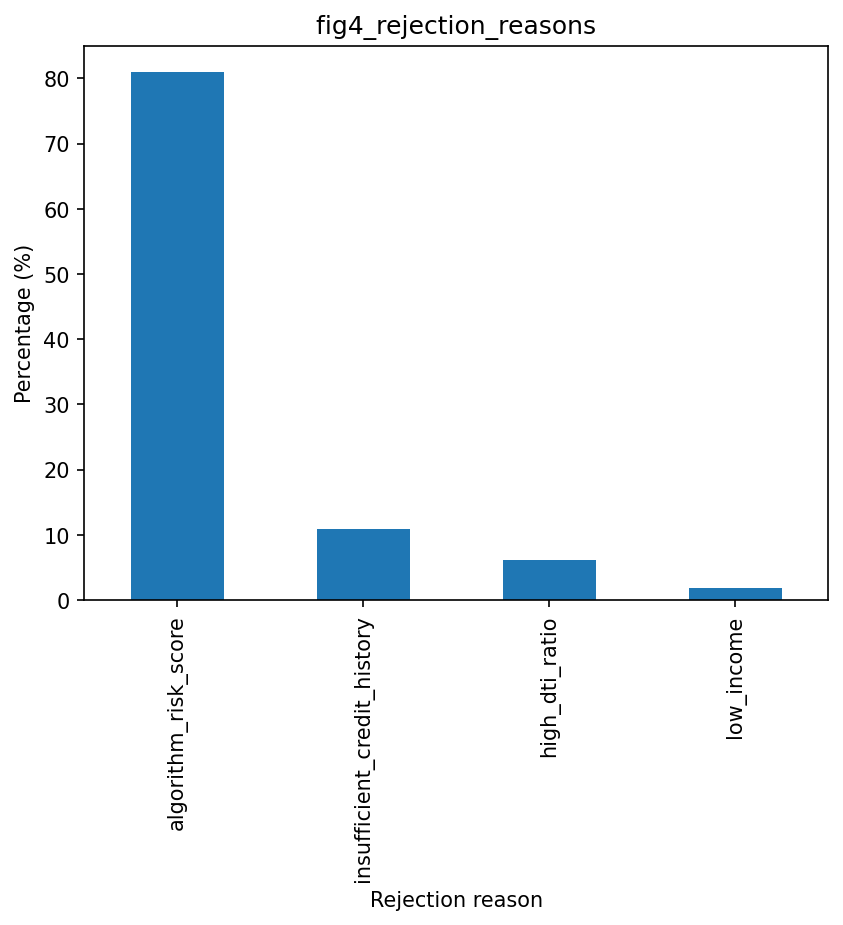

# dego-project-team11-TXC
**DEGO 2606 Group Project – Credit Application Governance Analysis**  
MSc Business Analytics | Nova SBE

---

## Team Members & Roles

| Name | Role |
|------|------|
| Inês Monteiro | Data Engineer — data ingestion, cleaning pipeline, repository structure |
| Anh Nguyen | Data Scientist — bias analysis, fairness metrics, statistical testing |
| Estêvão Fernandes | Governance Officer — GDPR mapping, compliance analysis, policy recommendations |
| Jonas Knosp | Product Lead — coordination, README, presentation narrative |

---

## Executive Summary

This report presents the findings of a data governance audit conducted on `raw_credit_applications.json`, a dataset of **502 credit applications** from NovaCred, a fintech company under regulatory scrutiny for potential discriminatory lending practices. The audit was structured around three analytical pillars: **data quality assessment**, **algorithmic bias detection**, and **privacy and GDPR compliance evaluation**.

Key findings are summarised below:

- **162 records (32.3%)** have `date_of_birth` in a non-standard or missing format — 101 records use `MM/DD/YYYY`, 56 use `YYYY/MM/DD`, and 5 are empty strings — preventing reliable age computation without prior normalisation.
- **22.1% of records (111/502)** exhibit inconsistent gender encoding, with **six distinct representations** (`Male`, `M`, `Female`, `F`, empty string, and absent field) used for what should be a controlled categorical field — a critical validity and consistency failure prior to any modelling step.
- A statistically significant gender-based disparity in loan approval rates was identified. Applying the four-fifths rule, the computed **Disparate Impact Ratio of 0.770** falls below the 0.80 threshold, indicating potential unlawful disparate impact on female applicants under EU anti-discrimination frameworks.
- **`zip_code` acts as a proxy for gender** (point-biserial correlation: −0.82), meaning geographic filtering reproduces gender bias even if gender is removed from the model.
- **Multiple categories of PII** — including Social Security Numbers, full names, email addresses, IP addresses, and dates of birth — are stored in plaintext with no evidence of pseudonymisation, encryption, or access controls, in direct conflict with GDPR Articles 5 and 25.
- The dominant rejection mechanism (`algorithm_risk_score`, accounting for **81.7% of denials**) is non-transparent and non-auditable, raising high-risk AI system concerns under the EU AI Act (Annex III, §5(b)).

---

## Repository Structure

```
dego-project-team11-TXC/
├── README.md
├── data/
│   ├── raw_credit_applications.json
│   └── cleaned_credit_applications.csv
├── notebooks/
│   ├── 01-data-quality.ipynb
│   ├── 02-bias-analysis.ipynb
│   └── 03-privacy-demo.ipynb
├── figures/
│   ├── fig1_missing_values.png
│   ├── fig2_distributions.png
│   ├── fig3_date_formats.png
│   ├── fig4_rejection_reasons.png
│   ├── fig5_approval_by_gender.png
│   └── fig6_correlation_heatmap.png
├── src/
│   └── fairness_utils.py
└── presentation/
    └── video_link.md
```

---

## Dataset Overview

**Source file:** `data/raw_credit_applications.json`  
**Format:** Nested JSON (not a flat tabular structure)  
**N:** 502 credit applications  
**Overall approval rate:** 58.2% (292/502)  
**Reference date for age calculations:** 2024-01-15 (inferred from `processing_timestamp`)

### Schema Summary

| Field Path | Type | Description |
|-----------|------|-------------|
| `_id` | String | Application ID |
| `applicant_info.full_name` | String | Applicant full name |
| `applicant_info.email` | String | Email address |
| `applicant_info.ssn` | String | Social Security Number |
| `applicant_info.ip_address` | String | IP address at application time |
| `applicant_info.gender` | String | Gender (inconsistently encoded — see §1.2) |
| `applicant_info.date_of_birth` | String | Date of birth (inconsistent formats — see §1.5) |
| `applicant_info.zip_code` | String | ZIP/postal code |
| `financials.annual_income` | Number | Annual income (5 records use `annual_salary` instead — see §1.2) |
| `financials.credit_history_months` | Integer | Months of credit history |
| `financials.debt_to_income` | Number | Debt-to-income ratio |
| `financials.savings_balance` | Number | Savings balance |
| `spending_behavior[].category` | String | Spending category label |
| `spending_behavior[].amount` | Number | Monthly spending amount |
| `decision.loan_approved` | Boolean | Approval outcome |
| `decision.interest_rate` | Number | Assigned rate (if approved) |
| `decision.approved_amount` | Number | Approved loan amount (if approved) |
| `decision.rejection_reason` | String | Rejection label (if denied) |
| `processing_timestamp` | String | Timestamp of processing (87.6% missing) |
| `loan_purpose` | String | Stated purpose of loan (~89.6% missing) |

> The dataset contains intentional data quality issues and bias patterns. All issues identified below are documented and quantified in `notebooks/01-data-quality.ipynb` and `notebooks/02-bias-analysis.ipynb`.

---

## 1. Data Quality Analysis

Full methodology and remediation code: `notebooks/01-data-quality.ipynb`

### 1.1 Completeness

| Field | Missing (n) | Missing (%) |
|-------|------------|------------|
| `loan_purpose` | ~450 | ~89.6% |
| `processing_timestamp` | 440 | 87.6% |
| `email` | 7 | 1.4% |
| `date_of_birth` | 5 | 1.0% |
| `ssn` | 5 | 1.0% |
| `annual_income` | 5 | 1.0% |
| `gender` | 3 | 0.6% |

  
*Figure 1: `processing_timestamp` and `loan_purpose` are too sparse for analytical use. The near-total absence of `processing_timestamp` (87.6% missing) means NovaCred cannot demonstrate GDPR storage limitation compliance (Art. 5(1)(e)) or produce audit trails required under the EU AI Act (Art. 12).*

### 1.2 Consistency

| Issue | Affected Records (n) | Affected Records (%) |
|-------|---------------------|---------------------|
| Inconsistent gender encoding (6 distinct values: `Male`, `M`, `Female`, `F`, `""`, absent) | 111 | 22.1% |
| Inconsistent `date_of_birth` formats (see §1.5) | 157 | 31.3% |
| Field name mismatch: `annual_salary` instead of `annual_income` | 5 | 1.0% |
| `annual_income` stored as string instead of number | 8 | 1.6% |
| Duplicate `_id` values | 2 | 0.4% |
| Approved loans missing `interest_rate` field | 3 | 0.6% |

### 1.3 Validity

| Issue | Affected (n) | Detail |
|-------|-------------|--------|
| Negative `credit_history_months` | 2 | Min observed: −10 months. Logically impossible. |
| Negative `savings_balance` | 1 | Cannot be negative under this schema definition. |
| `debt_to_income` > 1.0 | 1 | Total debt exceeds income — an invalid ratio. |
| `annual_income` = 0 | 1 | Likely a missing value recorded as zero rather than null. |
| Invalid email format (`sarah.smith@`) | 1 | Incomplete email stored in `email` field. |

  
*Figure 2: Red dashed lines mark invalid values — zero income, negative credit history months, and DTI above 1.0. All three require flagging before downstream modelling.*

### 1.4 Accuracy

| Issue | Detail |
|-------|--------|
| Duplicate `_id` | 2 records share the same application ID. Resolution: retain the record with the most recent `processing_timestamp`; flag the duplicate for human review. |
| Inconsistent gender encoding | The same attribute is represented as `Male`/`M` or `Female`/`F`, with additional empty strings and absent fields — an accuracy failure under GDPR Art. 5(1)(d). |
| Field name mismatch | 5 records use `annual_salary` instead of `annual_income`, silently losing income data for those applicants in any standard pipeline. |

### 1.5 Date Format Inconsistency

The `date_of_birth` field is stored as a plain string with **no enforced format**. Three distinct formats were detected:

| Format | Count (n) | Share (%) | Example |
|--------|-----------|-----------|---------|
| `YYYY-MM-DD` (ISO 8601 — standard) | 340 | 67.7% | `1985-06-15` |
| `MM/DD/YYYY` | 101 | 20.1% | `06/15/1985` |
| `YYYY/MM/DD` | 56 | 11.2% | `1985/06/15` |
| Empty string / missing | 5 | 1.0% | `""` |

**Records with non-standard format (excluding empty/missing): 157 (31.3%)**  
**Records with non-standard or missing date format (total): 162 (32.3%)**

  
*Figure 3: Three distinct date formats co-exist in the same field. Any age-based calculation performed without prior normalisation will silently produce incorrect results for 31.3% of records. One record (`app_183`) uses `MM/DD/YYYY` format — potentially ambiguous and requiring manual resolution.*

### 1.6 Data Quality Audit Summary

| Dimension | Verdict | Key Findings |
|-----------|---------|--------------|
| **Uniqueness** | FAIL | 2 duplicate `_id` values; 3 SSNs shared across records |
| **Consistency** | FAIL | 6 gender representations; 3 date formats; `annual_salary` vs `annual_income`; 8 strings in numeric fields |
| **Completeness** | FAIL | 5 missing SSNs, 5 missing income; 0/502 records have consent, retention, or processing purpose fields |
| **Validity** | FAIL | 1 zero income, 2 negative credit history, 1 impossible DTI, 1 negative savings, 1 malformed email |
| **Timeliness** | FAIL | 87.6% of records have no `processing_timestamp` |

**Overall: The dataset fails on all five data quality dimensions.**

### 1.7 Remediation Steps Demonstrated

1. **Gender standardisation** — map `M` → `Male`, `F` → `Female`; encode nulls/blanks as `Unknown`
2. **Date normalisation** — cascading `strptime` parser normalises all three formats to ISO 8601; ambiguous records flagged for human review
3. **Field name harmonisation** — rename `annual_salary` → `annual_income`; cast string values to numeric
4. **Duplicate resolution** — retain the record with the most recent `processing_timestamp` per `_id`
5. **Invalid value flagging** — records with `credit_history_months < 0`, `savings_balance < 0`, or `debt_to_income > 1.0` flagged with `is_invalid = True` and excluded from downstream modelling
6. **Zero-income imputation** — zero and null incomes imputed using field median; originals preserved in `annual_income_raw`
7. **Email validation** — malformed emails flagged via regex; not imputed

---

## 2. Bias Detection & Fairness Analysis

Full methodology and statistical analysis: `notebooks/02-bias-analysis.ipynb`

This analysis evaluates whether NovaCred's historical loan approval decisions show evidence of demographic bias. We investigate disparities across **gender**, **age groups**, and **intersectional combinations of both attributes**, and examine whether some features may act as **proxy variables** for protected characteristics.

### 2.1 Gender Bias

Approval rates differ substantially between male and female applicants.

| Gender | n | Approved | Approval Rate |
|--------|---|----------|---------------|
| Male | 248 | 163 | 65.7% |
| Female | 251 | 127 | 50.6% |
| Unknown/Missing | 3 | 2 | 66.7% |

Female applicants are approved **15.1 percentage points less often** than male applicants.

### 2.2 Disparate Impact

DI is calculated as:

```
DI = P(approved | Female) / P(approved | Male)
   = 0.506 / 0.657
   = 0.770
```

According to the **four-fifths rule**, values below **0.80** indicate potential disparate impact.

**Result: DI = 0.770 — below threshold. Potential adverse impact on female applicants confirmed.**

Demographic Parity Difference (DPD):

```
DPD = P(approved | Female) − P(approved | Male) = −0.151
```

### 2.3 Age-Based Bias

Approval rates also vary across age groups.

| Age Group | Approval Rate |
|-----------|---------------|
| 18–25 | 57.1% |
| 26–35 | 40.4% |
| 36–45 | 64.7% |
| 46–55 | 66.7% |
| 56–65 | 65.8% |

Applicants aged **26–35** have the lowest approval rate by a significant margin, suggesting potential age-related structural disparities.

### 2.4 Intersectional Bias (Age × Gender)

Combining demographic attributes reveals stronger disparities:

- Women aged **26–35**: approval rate ≈ **33%**
- Men aged **56–65**: approval rate ≈ **78%**

This indicates **intersectional bias**, where multiple attributes interact to amplify disparities beyond what either dimension shows in isolation.

### 2.5 Rejection Reason Distribution

| Rejection Reason | Count | Share |
|------------------|-------|-------|
| `algorithm_risk_score` | 170 | 81.7% |
| `insufficient_credit_history` | 23 | 11.1% |
| `high_dti_ratio` | 13 | 6.3% |
| `low_income` | 4 | 1.9% |

  


Most rejections (81.7%) are attributed to `algorithm_risk_score`, which functions as an opaque decision label with no interpretable breakdown for the affected applicant.

### 2.6 Proxy Discrimination Risk

Some variables may act as **indirect proxies for protected attributes**, reproducing bias even when those attributes are excluded from the model.

| Attribute | Potential Proxy For | Observation |
|-----------|---------------------|-------------|
| `zip_code` | Gender | Point-biserial correlation: −0.82 with gender |
| `credit_history_months` | Age | Younger applicants naturally have shorter credit histories |
| `annual_income` | Gender | Income disparities may indirectly reproduce gender gaps |
| `spending_behavior` categories | Sensitive traits | 15 categories including Healthcare, Gambling, Adult Entertainment |


These variables allow demographic disparities to persist **even if gender or age are explicitly removed from the model**.

---

## 3. Privacy & GDPR Assessment

Full implementation: `notebooks/03-privacy-demo.ipynb`

### 3.1 PII Inventory

| Field | PII Type | GDPR Classification | Plaintext? |
|-------|----------|---------------------|------------|
| `full_name` | Direct identifier | Art. 4(1) | Yes |
| `email` | Direct identifier | Art. 4(1) | Yes |
| `ssn` | Direct identifier | High sensitivity | Yes |
| `ip_address` | Direct identifier | Recital 30 | Yes |
| `date_of_birth` | Quasi-identifier | Art. 4(1) | Yes |
| `zip_code` | Quasi-identifier | Personal when combined | Yes |
| `gender` | Quasi-identifier | Art. 4(1) / potential Art. 9 | Yes |

### 3.2 GDPR Compliance Assessment

| Requirement | Article | Status | Finding |
|------------|---------|--------|---------|
| Lawful basis | Art. 6 | Undocumented | No documented legal basis in dataset or metadata |
| Data minimisation | Art. 5(1)(c) | Violated | `ip_address` unnecessary; granular spending categories expose sensitive lifestyle data |
| Storage limitation | Art. 5(1)(e) | Violated | No retention timestamps; `processing_timestamp` 87.6% missing |
| Accuracy | Art. 5(1)(d) | Violated | Inconsistent gender/date formats, invalid values, duplicates |
| Integrity & confidentiality | Art. 5(1)(f) | Violated | All direct identifiers stored in plaintext |
| Right to erasure | Art. 17 | Not implementable | No mechanism to locate and delete individual records |
| Automated decision-making | Art. 22 | Violated | No human review pathway; no explanation provided to applicants |
| Data Protection by Design | Art. 25 | Violated | No pseudonymisation, no access controls, no privacy-by-design evidence |

### 3.3 EU AI Act Classification

NovaCred's credit scoring system qualifies as a **high-risk AI system** under Annex III, §5(b) of the EU AI Act (Regulation (EU) 2024/1689). This triggers the full set of obligations including risk management (Art. 9), data governance (Art. 10), transparency (Art. 13), human oversight (Art. 14), and record-keeping (Art. 12). The audit found **no evidence of compliance** with any of these requirements.

### 3.4 Pseudonymisation Demonstration

`notebooks/03-privacy-demo.ipynb` demonstrates salted SHA-256 hashing of the `ssn` field. The salt is generated using `secrets.token_hex(32)` and must be stored separately from the hashed data, with independent access permissions.

---

## 4. Governance Recommendations

### 1. Pseudonymise All Direct Identifiers at Rest
**Finding:** `ssn`, `full_name`, `email`, and `ip_address` stored in plaintext.  
**Action:** Apply salted SHA-256 hashing to `ssn` immediately (demonstrated in notebook 03). Extend to `full_name` and `email` in all analytical copies. Restrict original identifiers to a production environment with role-based access controls.  
**Addresses:** GDPR Art. 5(1)(f); Art. 25

### 2. Remove or Justify `ip_address` and Sensitive `spending_behavior` Categories
**Finding:** `ip_address` serves no documented purpose in credit decisioning. Spending categories including `Adult Entertainment`, `Gambling`, `Alcohol`, and `Healthcare` may constitute special category data under Art. 9.  
**Action:** Remove `ip_address`. Replace per-category spending with `total_monthly_spending`.  
**Addresses:** GDPR Art. 5(1)(b); Art. 5(1)(c)

### 3. Enforce Input Validation at Ingestion
**Finding:** Six gender representations, three date formats, field name mismatches (`annual_salary`), type mismatches (income as string), and invalid numeric values — all passed ingestion unchecked.  
**Action:** Schema validator enforcing ISO 8601 dates, a controlled gender vocabulary (`Male`, `Female`, `Other`, `Prefer not to say`), standardised field names, non-negative numeric fields, and valid email format. Log all rejected submissions for review.  
**Addresses:** GDPR Art. 5(1)(d); EU AI Act Art. 10

### 4. Implement Bias Monitoring with Defined Thresholds
**Finding:** DI = 0.770 overall; DI ≈ 0.67 for women aged 26–35. `zip_code` correlation −0.82 with gender.  
**Action:** Compute DI by gender, age group, and intersection on every model retrain. Trigger mandatory human review when DI < 0.80. Flag `zip_code`, `credit_history_months`, and `annual_income` as proxy variables requiring ongoing monitoring.  
**Addresses:** GDPR Art. 5(1)(a); EU AI Act Art. 9; Art. 10

### 5. Replace `algorithm_risk_score` with Structured Rejection Reasons
**Finding:** 81.7% of rejections provide no actionable or interpretable explanation.  
**Action:** Add a `rejection_factors` field listing the top 3 contributing variables and their direction. Make this available to applicants upon request.  
**Addresses:** GDPR Art. 22; EU AI Act Art. 13

### 6. Introduce Human-in-the-Loop Review
**Finding:** No human review fields exist; all credit rejections are fully automated.  
**Action:** Add `reviewed_by`, `review_timestamp`, and `override_decision` fields. Mandate human review before communicating any rejection decision.  
**Addresses:** GDPR Art. 22; EU AI Act Art. 14

### 7. Implement a Data Retention Policy
**Finding:** No retention fields exist; data appears stored indefinitely.  
**Action:** Add `retention_until` at ingestion. Implement a monthly automated archival/deletion job. Document in a Records of Processing Activities (ROPA) register.  
**Addresses:** GDPR Art. 5(1)(e); Art. 30

### 8. Conduct a Data Protection Impact Assessment (DPIA)
**Finding:** High-risk automated system processing sensitive PII at scale; no DPIA evidence present.  
**Action:** Conduct a DPIA under GDPR Art. 35 before further deployment or retraining. Include bias risk, data quality failures, and lack of human oversight in scope.  
**Addresses:** GDPR Art. 35; EU AI Act Art. 9; Art. 43

---

## 5. How to Reproduce

```bash
pip install pandas numpy matplotlib seaborn fairlearn jupyter
```

Run notebooks in order:

1. `notebooks/01-data-quality.ipynb` → outputs `data/cleaned_credit_applications.csv` + all figures to `figures/`
2. `notebooks/02-bias-analysis.ipynb` → reads `data/cleaned_credit_applications.csv`
3. `notebooks/03-privacy-demo.ipynb` → reads raw JSON `data/raw_credit_applications.json` (by design)

---

## 6. Git Collaboration

### Branch Structure

```
main
└── dev
    ├── feature/data-quality       (Inês)
    ├── feature/bias-analysis      (Anh)
    ├── feature/privacy-gdpr       (Estêvão)
    └── feature/readme-docs        (Jonas)
```

### Commit Prefixes

`[data]` · `[bias]` · `[privacy]` · `[docs]` · `[fix]`

### Contributions

| Member | Primary Work |
|--------|-------------|
| Inês Monteiro | Data loading, JSON flattening, date normalisation, field name harmonisation, cleaning pipeline, `01-data-quality.ipynb` |
| Anh Nguyen | DI ratio, DPD, age-group intersectional analysis, proxy analysis, `02-bias-analysis.ipynb`, `src/fairness_utils.py` |
| Estêvão Fernandes | PII inventory, salted pseudonymisation, GDPR mapping, EU AI Act classification, `03-privacy-demo.ipynb` |
| Jonas Knosp | README, governance recommendations, presentation narrative, PR reviews |

**Video:** [https://youtu.be/NG7pcE6AMfY](https://youtu.be/NG7pcE6AMfY)

---

*DEGO 2606 | MSc Business Analytics | Nova SBE | Team 11 – TXC | February 2026*
